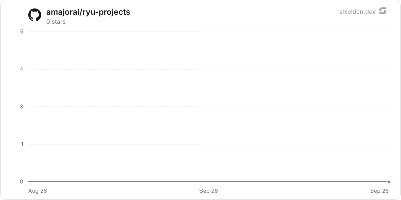

<p align="center">
  <picture>
    <source media="(prefers-color-scheme: dark)" srcset="./icon-dark.png" />
    
  </picture>
</p>

<div align="center">

# Projects

</div>

A durable coordinator workspace for projects, shared context, delegated workers, and recurring signals.

> **The public home of `ryu-projects`.** Source, builds, and releases live here —
> binaries for every platform are attached to each release.
>
> This tree is generated from the Ryu monorepo, so commits pushed here
> directly are replaced on the next sync. **Pull requests are welcome** —
> open them here and they are ported into the monorepo, then flow back out.
> Ryu as a whole: https://github.com/amajorai/ryu

## Install

**App:** [Install](ryu://apps/@ryu/projects) (opens the Ryu desktop app and asks you to confirm)

**CLI:**

```bash
ryu apps add @ryu/projects
```

## Source & build

This satellite carries the Rust coordinator backend plus the Companion UI.
The backend builds with Cargo; the UI imports Ryu's private `@ryu/ui`
design system and is shipped as the prebuilt `dist/index.html` bundle.

## License

Apache-2.0 — see [LICENSE](./LICENSE).

## Build and test

```sh
bun run --cwd apps-store/projects/ui test
bun run --cwd apps-store/projects/ui check-types
bun run --cwd apps-store/projects/ui build

# Sidecar checks
RYU_PROFILE=dev RYU_KEYCHAIN=off RYU_DIR=/tmp/ryu-projects-headless cargo test -p ryu-projects
```

## Star History

<a href="https://github.com/amajorai/ryu-projects/stargazers">
  <picture>
    <source media="(prefers-color-scheme: dark)" srcset="./.github/shieldcn/star-chart-dark.svg" />
    
  </picture>
</a>
